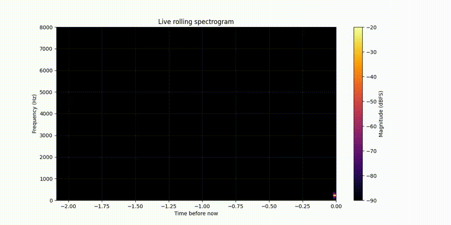

# Fourier Audio Explorer

A playful little signal-processing project for seeing sound as it happens.

This project turns audio into a rolling spectrogram: a live view of which frequencies are present over time. It can visualize a WAV file, export the animation as an MP4, listen to a microphone, and let you click frequency bands to hear filtered playback.



## What It Does

- Plays a WAV file while drawing a rolling spectrogram.
- Exports spectrogram animations as shareable MP4 videos.
- Supports live microphone input.
- Lets you click two frequency cutoffs to apply a bandpass filter.
- Uses a Butterworth SOS filter for faster, more stable filtering.
- Includes tuning controls for FFT window size, hop size, history length, and displayed frequency range.

## Quick Start

Install dependencies:

```bash
python -m pip install -r requirements.txt
```

Run the default WAV visualizer:

```bash
python main.py
```

Export a video:

```bash
python main.py --export-video
```

Use a specific audio file:

```bash
python main.py --audio path/to/file.wav
```

Export only the first 15 seconds:

```bash
python main.py --audio assets/audio/synthetic_demo.wav --duration 15 --export-video
```

## Microphone Mode

List audio devices:

```bash
python main.py --list-devices
```

Test a microphone level:

```bash
python main.py --test-mic --input-device 2
```

Run the live microphone spectrogram:

```bash
python main.py --mic --input-device 2 --mic-gain-db 10
```

Press `q` while the spectrogram window is focused to stop microphone mode.

## Useful Controls

Better frequency separation:

```bash
python main.py --window-size 8192 --hop-size 512 --max-display-freq 6000
```

Smoother movement:

```bash
python main.py --window-size 2048 --hop-size 256
```

Show more high-end content:

```bash
python main.py --max-display-freq 12000
```

Boost quiet microphone input visually:

```bash
python main.py --mic --input-device 2 --mic-gain-db 30
```

## How The Visualization Works

Audio is a changing pressure signal. A spectrogram slices that signal into short chunks and runs a Fourier transform on each chunk. Each column in the image is one FFT result:

```text
audio chunk -> window function -> FFT -> magnitude in dB -> spectrogram column
```

The rolling display keeps the newest FFT column on the right and scrolls older columns left. Bright colors mean stronger frequency energy.

More detail is in [docs/how-it-works.md](docs/how-it-works.md).

## Bandpass Filtering

Click once on the spectrogram to choose the first cutoff frequency. Click again to choose the second cutoff. The selected band is highlighted, and playback is filtered to keep mostly that range.

The filter uses SciPy's Butterworth filter design with second-order sections:

```python
butter(order, [low, high], btype="bandpass", output="sos")
```

SOS filters are more numerically stable than high-order numerator/denominator filters, and they are efficient enough for live chunked playback.

## Demo Assets

The demo media in `assets/` is generated from synthetic audio so the repo can be shared publicly without relying on copyrighted songs.

Generate the demo WAV:

```bash
python scripts/generate_demo_audio.py
```

Export the demo video:

```bash
python main.py --audio assets/audio/synthetic_demo.wav --duration 15 --export-video --no-audio --output-folder assets/videos
```

Create a GIF from the exported MP4 with FFmpeg:

```bash
ffmpeg -y -i assets/videos/synthetic_demo.mp4 -vf "fps=12,scale=900:-1:flags=lanczos" assets/gifs/synthetic_demo.gif
```

## Troubleshooting

If microphone mode looks flat, first run:

```bash
python main.py --test-mic --input-device DEVICE_NUMBER
```

If the peak stays around `-80 dBFS` or lower while you talk or clap, Windows is probably sending silence to Python. See [docs/microphone-troubleshooting.md](docs/microphone-troubleshooting.md).

## Project Ideas

This is a good starting point for:

- learning FFTs and spectrograms
- building audio-reactive visuals
- experimenting with filters
- exploring speech/music features
- preparing audio representations for machine learning

Some possible next steps are in [docs/roadmap.md](docs/roadmap.md).
